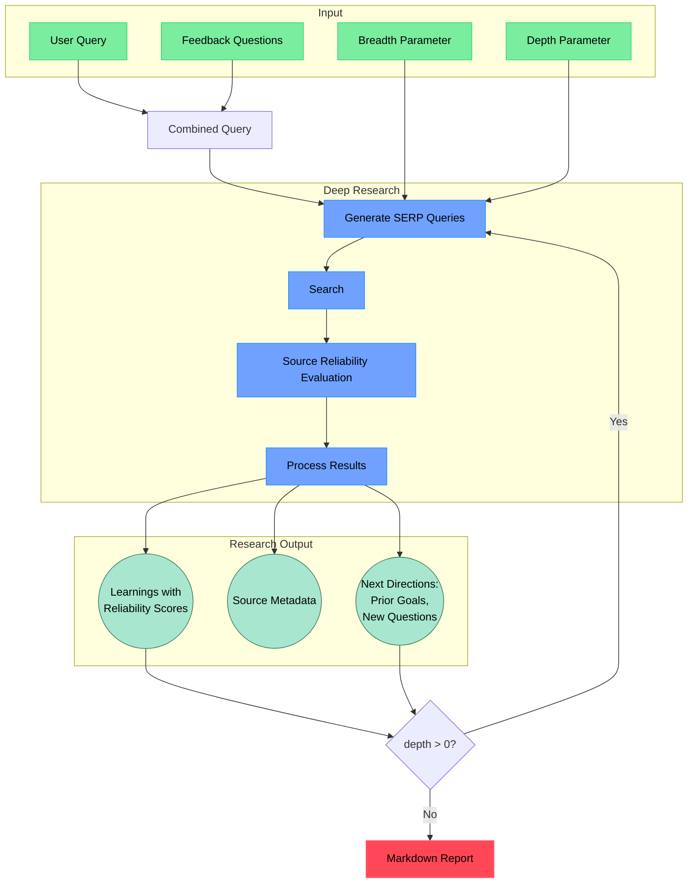

# Open Deep Research MCP Server

An AI-powered research assistant that performs deep, iterative research on any topic. It combines search engines, web scraping, and AI to explore topics in depth and generate comprehensive reports. Available as a Model Context Protocol (MCP) tool or standalone CLI. Look at exampleout.md to see what a report might look like.

## Quick Start

1. Clone and install:
```bash
git clone https://github.com/Ozamatash/deep-research
cd deep-research
npm install
```

2. Set up environment in `.env.local`:
```bash
# Copy the example environment file
cp .env.example .env.local
```

3. Build:
```bash
# Build the server
npm run build
```

4. Run the cli version:
```bash
npm run start "Your research query here"
```
5. Test MCP Server with Claude Desktop:  
Follow the guide thats at the bottom of server quickstart to add the server to Claude Desktop:  
https://modelcontextprotocol.io/quickstart/server

For remote servers: Streamable HTTP
```bash
npm run start:http
```
Server runs on `http://localhost:3000/mcp` without session management.

## Features

- Performs deep, iterative research by generating targeted search queries
- Controls research scope with depth (how deep) and breadth (how wide) parameters
- Evaluates source reliability with detailed scoring (0-1) and reasoning
- Prioritizes high-reliability sources (≥0.7) and verifies less reliable information
- Generates follow-up questions to better understand research needs
- Produces detailed markdown reports with findings, sources, and reliability assessments
- Available as a Model Context Protocol (MCP) tool for AI agents
- For now MCP version doesn't ask follow up questions

## How It Works


## Advanced Setup

### Using Local Firecrawl (Free Option)

Instead of using the Firecrawl API, you can run a local instance. You can use the official repo or my fork which uses searXNG as the search backend to avoid using a searchapi key:

1. Set up local Firecrawl:
```bash
git clone https://github.com/Ozamatash/localfirecrawl
cd localfirecrawl
# Follow setup in localfirecrawl README
```

2. Update `.env.local`:
```bash
FIRECRAWL_BASE_URL="http://localhost:3002"
```

### Optional: Observability

Add observability to track research flows, queries, and results using Langfuse:

```bash
# Add to .env.local
LANGFUSE_PUBLIC_KEY="your_langfuse_public_key"
LANGFUSE_SECRET_KEY="your_langfuse_secret_key"
```

The app works normally without observability if no Langfuse keys are provided.

## License

MIT License
