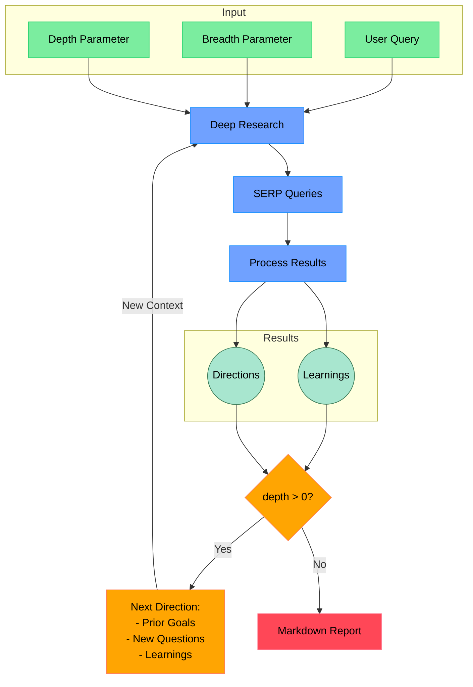

# Open Deep Research

An AI-powered research assistant that performs iterative, deep research on any topic by combining search engines, web scraping, and large language models. Available as a Model Context Protocol (MCP) tool for seamless integration with AI agents.

The goal of this repo is to provide the simplest implementation of a deep research agent - e.g. an agent that can refine its research direction over time and deep dive into a topic. Goal is to keep the repo size at <500 LoC so it is easy to understand and build on top of.

If you like this project, please consider starring it and giving me a follow on [X/Twitter](https://x.com/dzhng). This project is sponsored by [Aomni](https://aomni.com).

## How It Works



## Features

- **MCP Integration**: Available as a Model Context Protocol tool for seamless integration with AI agents
- **Iterative Research**: Performs deep research by iteratively generating search queries, processing results, and diving deeper based on findings
- **Intelligent Query Generation**: Uses LLMs to generate targeted search queries based on research goals and previous findings
- **Depth & Breadth Control**: Configurable parameters to control how wide (breadth) and deep (depth) the research goes
- **Smart Follow-up**: Generates follow-up questions to better understand research needs
- **Comprehensive Reports**: Produces detailed markdown reports with findings and sources
- **Concurrent Processing**: Handles multiple searches and result processing in parallel for efficiency

## Requirements

- Node.js environment (v22.x recommended)
- API keys for:
  - Firecrawl API (for web search and content extraction)
  - OpenAI API (for o3 mini model)

## Setup

### Node.js

1. Clone the repository
2. Install dependencies:

```bash
npm install
```

3. Set up environment variables in a `.env.local` file:

```bash
OPENAI_API_KEY="your_openai_key"
FIRECRAWL_KEY="your_firecrawl_key"
# Optional: If you want to use your self-hosted Firecrawl
# FIRECRAWL_BASE_URL="http://localhost:3002"
```

4. Build the project:

```bash
npm run build
```

## Usage

### As an MCP Tool

The deep research functionality is available as an MCP tool that can be used by AI agents. To start the MCP server:

```bash
node --env-file .env.local dist/mcp-server.js
```

The tool provides the following parameters:
- `query` (string): The research query to investigate
- `depth` (number, 1-5): How deep to go in the research tree
- `breadth` (number, 1-5): How broad to make each research level
- `existingLearnings` (string[], optional): Array of existing research findings to build upon

Example tool usage in an agent:
```typescript
const result = await mcp.invoke("deep-research", {
  query: "What are the latest developments in quantum computing?",
  depth: 3,
  breadth: 3
});
```

The tool returns:
- A detailed markdown report of the findings
- List of sources used in the research
- Metadata about learnings and visited URLs

### Standalone Usage

For standalone usage without MCP, you can use the CLI interface:

```bash
npm run start "Your research query here"
```

## Development

To run in development mode with automatic reloading:

```bash
npm run build:watch
```

To test the MCP server with the inspector:

```bash
npx @modelcontextprotocol/inspector node --env-file .env.local dist/mcp-server.js
```

## License

MIT License - feel free to use and modify as needed.
